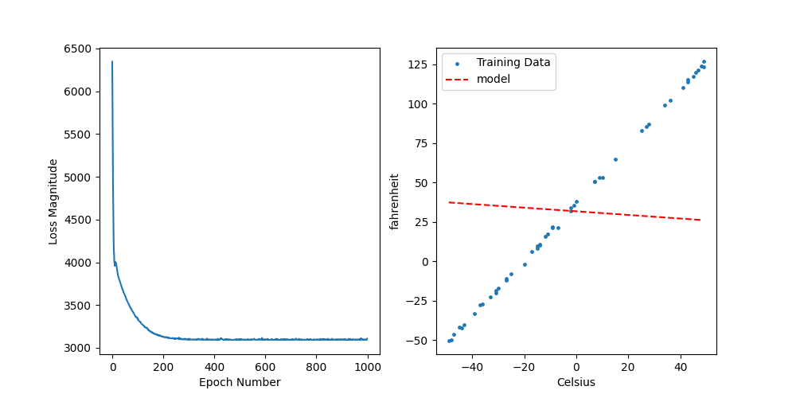
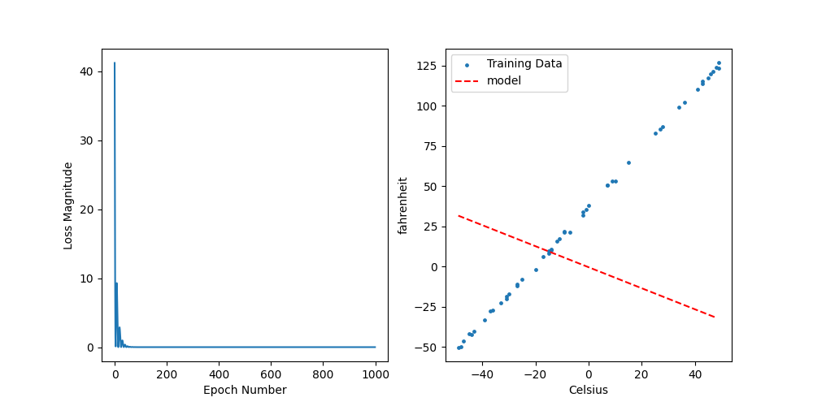
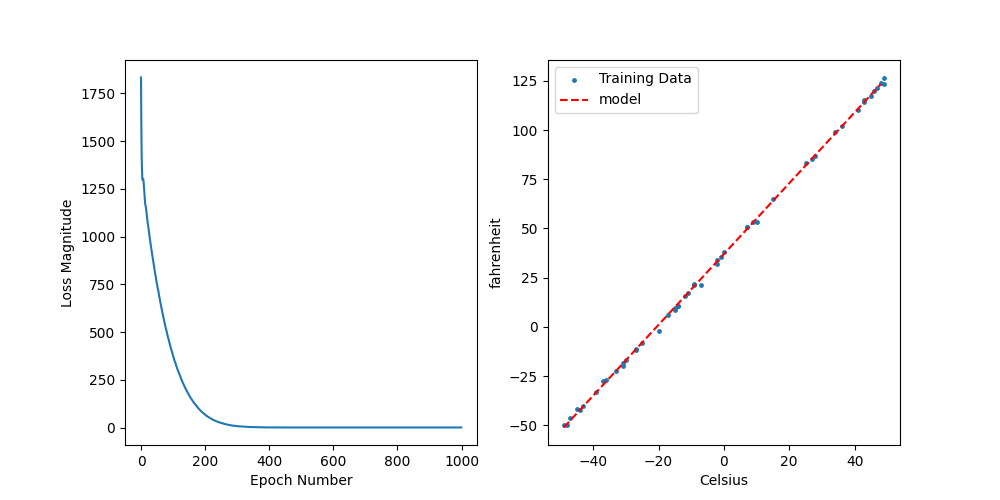

Sometimes when training a machine learning model, the model won't learn at all. By this, I mean the performance metrics do not improve during training at any point. There are two broad reasons why this could be the case:

1. There is a problem with your model setup
2. There is a problem with your data setup

But which is it?


Luckily, there is a simple test we can do to determine whats going on:

**Overfit the model to one sample from our data**

## What does this accomplish?

A machine learning model should always be able to overfit to a single sample of your dataset, even if its simply memorizing the data pair. If your model cannot be trained to overfit to one sample in your data, then there is almost certainly something wrong with the model setup. By trying to overfit to one sample of our data, we are simplifying the problem from "Can my model learn a relationship between x and y?" to " Can my model transform x to y?".

## How do I purposely overfit the model to a single sample from the training data?

1. Reduce the training dataset down to a single x - y pair.
2. Train the model on this single data pair until the loss is 0.


## Example

Below is a simple Machine learning script that loads some data, builds a model, trains a model, and monitors the performance during training. We are building a linear regression model to predict the temperature in Fahrenheit when given the temperature in Celsius.

```
# Import libraries
import numpy as np
import tensorflow as tf
import matplotlib.pyplot as plt

# Define Data
celsius_q    = np.array([-40, -10,  0,  8, 15, 22,  38],  dtype=float)
fahrenheit_a = np.array([-40,  14, 32, 46, 59, 72, 100],  dtype=float)

# Build, Compile and fit Model
model = tf.keras.Sequential([
  tf.keras.layers.Dense(units=1, input_shape=[1], activation='softmax')
])

model.compile(loss='mean_squared_error',
              optimizer=tf.keras.optimizers.Adam(0.1))

history = model.fit(celsius_q, fahrenheit_a, epochs=100, verbose=False)
```

To evaluate the performance of our model, we will plot training loss curve and the model against the training data. This function will be repeatedly used throughout the blog.

```
def evaluate_results(history, model, celsius_q, fahrenheit_a):
    fig, axes = plt.subplots(1, 2, figsize=(10, 5))
    axes[0].plot(history.history['loss'])
    axes[0].set_xlabel('Epoch Number')
    axes[0].set_ylabel("Loss Magnitude")

    input_data = np.arange(celsius_q.min(), celsius_q.max())
    axes[1].scatter(celsius_q, fahrenheit_a, label='Training Data')
    axes[1].plot(input_data, model.predict(input_data), 'r--', label='model')
    axes[1].set_xlabel('Celsius')
    axes[1].set_ylabel('fahrenheit')
    axes[1].legend()
    return fig


evaluate_results(history, model, celsius_q, fahrenheit_a)
```


Oh no! The plot shows the loss is completely flat during training. This tells us, that as we pass data through the model, the model is getting no better at predicting our output (y) from our input (x). Lets implement our magic test of trying to overfit to one sample from our data.

```
# Reduce the data size to one sample
history = model.fit(celsius_q[0:1], fahrenheit_a[0:1], epochs=100, verbose=False)
evaluate_results(history, model, celsius_q, fahrenheit_a)
```


Our learning curve is still flat! This tells us something is wrong with the model setup because the model is incapable of transforming the input to the output. Lets take another look at our model to ensure we aren't doing anything silly.

We are making a simple mistake in our model setup. The 'softmax' activation function attached to the end of our dense layer forces values to be between 0-1. This is a very common activation function to use when dealing with classification problems (when labels are either 0 or 1), but has been accidentally copied into this regression model. Lets remove the softmax and redo the test:

```
# Build, Compile and fit Model
model = tf.keras.Sequential([
  tf.keras.layers.Dense(units=1, input_shape=[1])
])

model.compile(loss='mean_squared_error',
              optimizer=tf.keras.optimizers.Adam(0.1))

history = model.fit(celsius_q[0:1], fahrenheit_a[0:1], epochs=100, verbose=False)
evaluate_results(history, model, celsius_q, fahrenheit_a)
```


Hooray! The loss has now reduced to 0. This tells us the model perfectly predicts the single data example we have used for training. This is good because it tells us the model has the capability to transform x to y. However, we can see the model is only good at predicting the single data point we have trained with. Now, lets train with the full dataset to see if our new fixed model can learn a good model to fit the data.

```
history = model.fit(celsius_q, fahrenheit_a, epochs=1000, verbose=False)
```


The model now trains to a loss of nearly 0 and accurately predicts temperatures in Fahrenheit from Celius.

<!-- # Example 2

Now lets stick with the same problem, but increase the amount of data we use. Lets also do some other good machine learning practices such as shuffling the data.

```
# Generate data using function
def celsius_to_fahrenheit(celsius):
    return (celsius*1.8) + 32

# Generate training data (note I've added some noise to simulate noisier data)
celsius_q = np.random.randint(-50, 50, size=50)
fahrenheit_a = celsius_to_fahrenheit(celsius_q) + np.random.normal(3, size=len(celsius_q))
```

Now we've generated more data, lets build the same model. However, this time we will shuffle the data as this is good practice for improving the performance of gradient descent.

```
# Build, Compile and fit Model - Same model as Example 1
model = tf.keras.Sequential([
  tf.keras.layers.Dense(units=1, input_shape=[1])
])

model.compile(loss='mean_squared_error',
              optimizer=tf.keras.optimizers.Adam(0.1))

history = model.fit(tf.random.shuffle(celsius_q), tf.random.shuffle(fahrenheit_a), epochs=1000, verbose=False)

evaluate_results(history, model, celsius_q, fahrenheit_a)
```


The training starts by decreasing the loss, but soon flattens at a relatively high error. This is also shown by the bad fit of the model. So what is happening here? Lets do our 1 sample overfit test. .

```
history = model.fit(tf.random.shuffle(celsius_q)[0:1], tf.random.shuffle(fahrenheit_a)[0:1], epochs=1000, verbose=False)

evaluate_results(history, model, celsius_q, fahrenheit_a)
```


The loss reduces to 0! Therefore, we can be confident that the model is correctly setup. Therefore, the problem is more likely to lie with the data.

One possible explanation could be the model is not complex enough (too few parameters) to learn the data relationship. To test this, we could add more layers to our model to incerease the number of parameters. However, for this example we can see from our data plots that the data relationship is linear and therefore should be capable of reducing the error to ~0.

Therefore, this would suggest there is something wrong with how the data is being prepared. In this case, the problem is the x and y data is being shuffled incorrectly! If we feed both x and y data into the shuffle command together, we ensure they are shuffled in sync.

```
celsius_q, fahrenheit_a = tf.random.shuffle((celsius_q, fahrenheit_a)).numpy()

history = model.fit(celsius_q, fahrenheit_a, epochs=1000, verbose=False)
evaluate_results(history, model, celsius_q, fahrenheit_a)
```
 -->

# Conclusions

- Deliberately overfitting a model to a single sample is a good way of debugging machine learning code.

- If the model can be perfectly fit to a single sample, then the model is capable of transforming the input to the output. This suggests your model setup is correct and you can move on to evaluating performance on more data.

- If the model can't overfit to a single sample, this implies there is a bug in the model setup. A ML model should always be able to overfit to a single example.

<!--more-->

